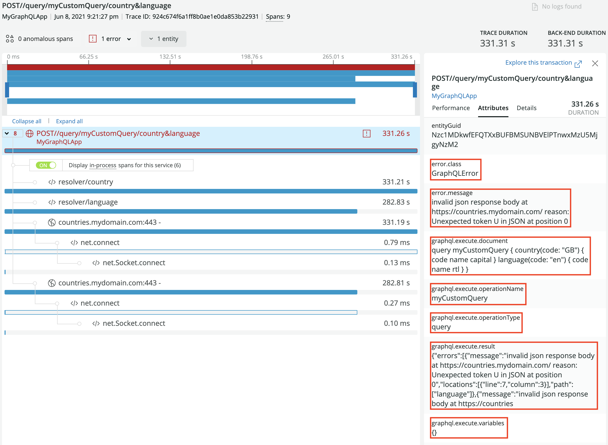
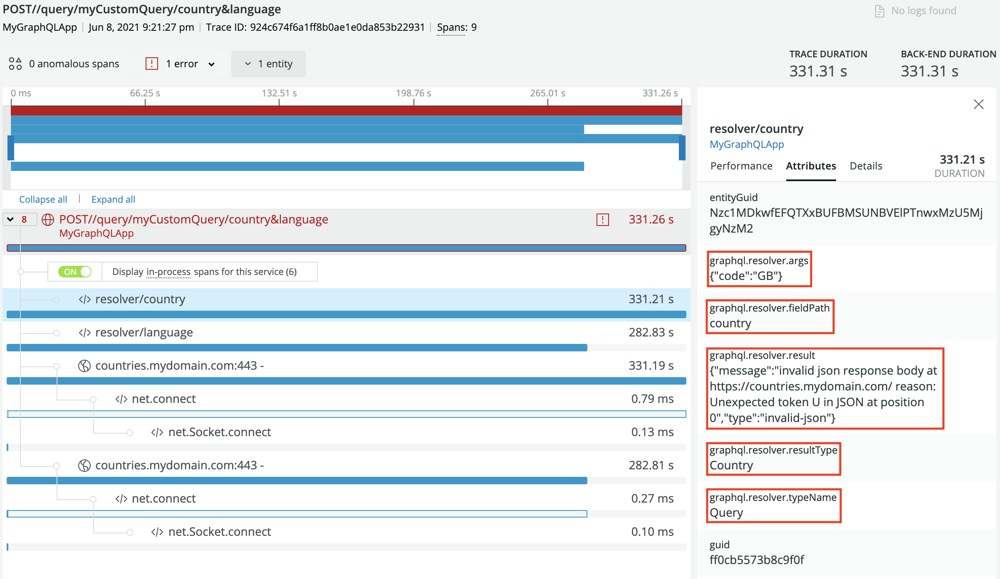
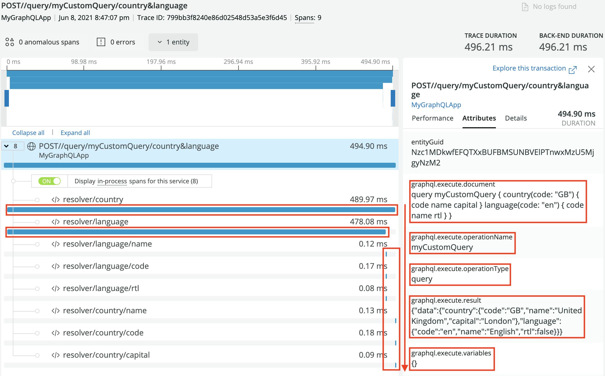

## `@envelop/newrelic`

Instrument your GraphQL application with New Relic reporting.  
Take advantage of Distributed tracing to monitor performance and errors whilst ultimately getting to the root cause of issues.

Below are some screenshots to show how tracking looks like in New Relic, in these examples all plugin options were set to `true`.

Error tracking, operation and resolver views:



Successful operation tracking, operation plus root-field and sub-field resolvers:



## Getting Started

1. Install dependencies
2. Configure the New Relic Agent
3. Setup the New Relic Envelop plugin

## Installation

This plugin expects the Node.js agent, [newrelic npm package](https://www.npmjs.com/package/newrelic), to be installed in your application.

```
yarn add newrelic @envelop/newrelic
```

## Basic usage Example

```ts
import { envelop } from '@envelop/core';
import { useNewRelic } from '@envelop/newrelic';

const getEnveloped = envelop({
  plugins: [
    // ... other plugins ...
    useNewRelic({
      includeOperationDocument: true, // default `false`. When set to `true`, includes the GraphQL document defining the operations and fragments
      includeExecuteVariables: false, // default `false`. When set to `true`, includes all the operation variables with their values
      includeRawResult: false, // default: `false`. When set to `true`, includes the execution result
      trackResolvers: true, // default `false`. When set to `true`, track resolvers as segments to monitor their performance
      includeResolverArgs: false, // default `false`. When set to `true`, includes all the arguments passed to resolvers with their values
      rootFieldsNaming: true, // default `false`. When set to `true` append the names of operation root fields to the transaction name
      operationNameProperty: 'id', // default empty. When passed will check for the property name passed, within the document object. Will eventually use its value as operation name. Useful for custom document properties (e.g. queryId/hash)
    }),
  ],
});
```

> Note: Transaction and segment/span timings may be affected by other plugins used. In order to get more accurate tracking, it is recommended to add the New Relic plugin last.

## Advanced usage
The plugin allows you to keep control over the variables and arguments that are tracked in New Relic.  
In addition to the basic `true/false` boolean value, `includeExecuteVariables` and `includeResolverArgs` also accept a RegEx pattern. This allows you to implement white and black listing of properties to be tracked in New Relic.  

This is particularly useful if you have properties coming through variables and arguments that are useful for debugging, but you don't want to leak users' data (such as PII).  
Below is a quick example of how you can use RegEx to set up white/black listing functionalities.  

```ts
useNewRelic({
  includeExecuteVariables: /^(client.*|application.*)$.*$/i, // whitelist, track only variables whose name starts with client or application (e.g. clientName, applicationId)
  trackResolvers: true, // track resolvers, since we also want to track resolvers' arguments
  includeResolverArgs: /^(?!(name|email|password)$).*$/, // blacklist, track all arguments whose name does not match 'name', 'email' nor 'password'
}),
```

Obviously, the ones above are just a couple of examples, but clearly you have endless options to use any RegEx pattern to filter the variables and arguments in the way that best work for you.  

> Be aware that the only way to filter variables and arguments is to loop through them, so there is an O(_n_) cost when filtering, where _n_ is the number of variables sent to the operation (when tracking execute variables), or the number of arguments passed to resolvers (when tracking resolvers arguments).
## Agent Configuration

For full details about New Relic Agent configuration, we recommend reading [New Relic's official Node.js agent configuration documentation](https://docs.newrelic.com/docs/agents/nodejs-agent/installation-configuration/nodejs-agent-configuration/).

The main methods to configure the New Relic Agent is through:

- The newrelic.js file [or]
- The environment variables

If you choose to use the newrelic.js file, then you need this file located in the root of your application. You can look [here](https://github.com/newrelic/node-newrelic/blob/main/newrelic.js) for a basic example of what this file can look like.

If you choose to configure the New Relic Agent through environment variables, then you can follow your preferred strategy to make sure the variables are set and available when your application starts.  
The variables are the same you can set in newrelic.js file, you just need to know that they need to start with `NEW_RELIC_`, obviously, the variables name must be fully uppercase.

The two variables that are always required are:  

| Description | newrelic.js | Environment variable |
| ----------- | ----------- | -------------------- |
| Application name | `app_name: ['MyAppName']` | `NEW_RELIC_APP_NAME=MyAppName` |
| License key | `license_key: '40HexadecimalCharacters'` | `NEW_RELIC_LICENSE_KEY=40HexadecimalCharacters` |

Other variables that are popularly used are:  

| Description | newrelic.js | Environment variable |
| ----------- | ----------- | -------------------- |
| Enable distributed tracing | `distributed_tracing: { enabled: true }` | `NEW_RELIC_DISTRIBUTED_TRACING_ENABLED=true` |
| Logging level | `logging: { level: 'info' }` | `NEW_RELIC_LOG_LEVEL=info` |
| Capture all request headers | `allow_all_headers: true` | `NEW_RELIC_ALLOW_ALL_HEADERS=true` |
| Enable error collection | `error_collector: { enabled: true }` | `NEW_RELIC_ERROR_COLLECTOR_ENABLED=true` |

Finally, [here](https://github.com/newrelic/node-newrelic/blob/main/lib/config/default.js) is also a reference of all the configuration variables you can include in your newrelic.js file, or translate into the env variables equivalent.
